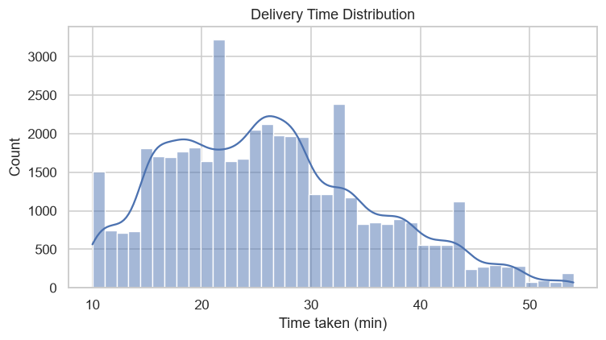
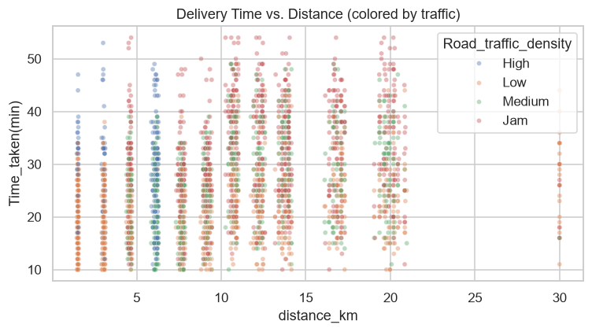
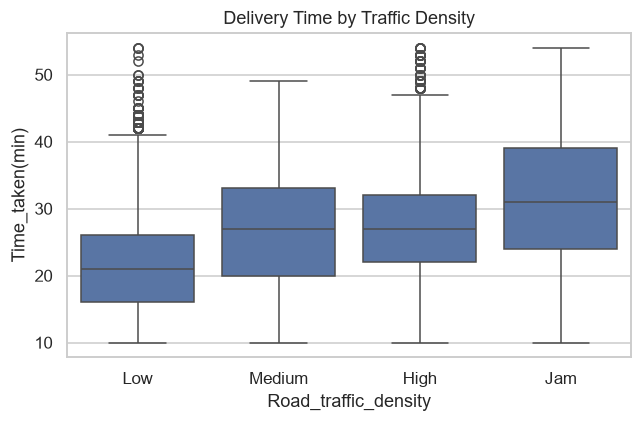
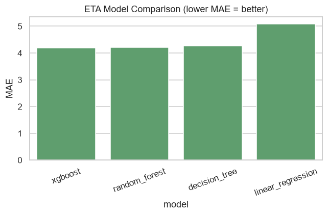
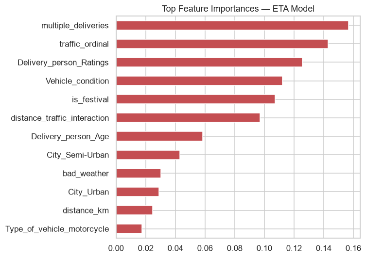
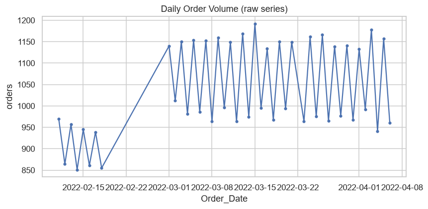
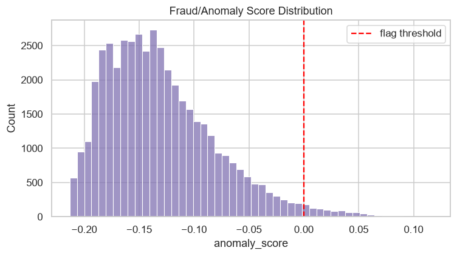
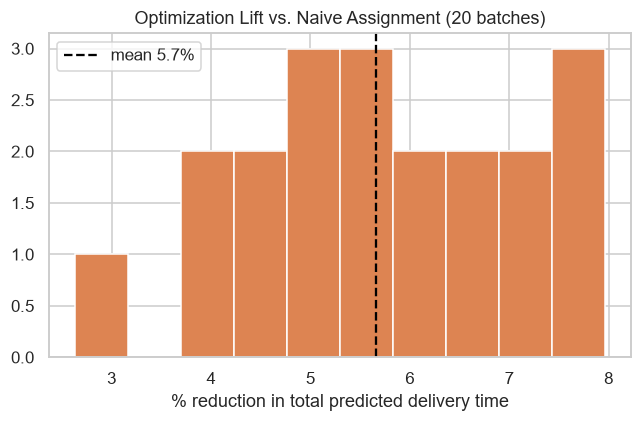

# 🛵 Delivery Intelligence Platform

**An end-to-end ML system built on one real operational dataset, demonstrating six problem classes an ML engineer is expected to own in production: forecasting, logistics optimization, ETA prediction, recommendations, fraud detection, and operational automation.**


---

## Why this project

Most "ML portfolio" repos show one model solving one Kaggle leaderboard metric. Real ML engineering roles rarely look like that — you're asked to predict something (ETA), plan around it (staffing, dispatch), rank things with it (partner matching), police it (fraud), optimize with it (assignment), and keep it alive (monitoring/retraining). This project uses a **single food-delivery dataset** to build all six, with one core regression model reused as the scoring function for three of them — the same way a real ETA model gets reused across a logistics stack rather than living in its own silo.

**Dataset:** [Food Delivery Dataset (Kaggle)](https://www.kaggle.com/datasets/gauravmalik26/food-delivery-dataset) — 45,593 training / 11,399 test real food-delivery orders: restaurant & delivery coordinates, weather, traffic density, delivery-partner attributes, and delivery time.

---

## Architecture

```
                         ┌──────────────────────┐
                         │   Raw Kaggle CSVs     │
                         └──────────┬───────────┘
                                    │  src/data_prep.py
                                    ▼
                     ┌──────────────────────────────┐
                     │   Cleaned + engineered data   │
                     └──────────────┬───────────────┘
                                    │
        ┌─────────────┬────────────┼────────────┬─────────────┐
        ▼             ▼            ▼            ▼             ▼
   ETA Model     Demand Fore-  Partner       Fraud/Anomaly  Logistics
   (XGBoost)     casting       Profiles      Detection      Optimization
   src/eta_      (GBM +        + Recom-      (Isolation     (Hungarian
   model.py      lag features)  mendation     Forest)       algorithm)
        │        src/fore-     Engine                       src/logistics_
        │        casting.py    src/recom-    src/fraud_     optimization.py
        │                      mendation.py  detection.py
        └─────────────┬────────────────────────────┬────────────┘
                       │   (ETA model reused as      │
                       │    scoring function)        │
                       ▼                              ▼
              ┌─────────────────────────────────────────────┐
              │     src/pipeline.py — one-command retrain    │
              │     src/monitoring.py — drift detection gate │
              └──────────────────┬────────────────────────────┘
                                 ▼
                      ┌────────────────────┐
                      │  Streamlit demo app │
                      │  (6 tabs, 1 per     │
                      │   module)           │
                      └────────────────────┘
```

---

## The six modules

| # | Domain | What it does | Result |
|---|--------|--------------|--------|
| 1 | **ETA Prediction** (core) | Regression comparing Linear/Decision Tree/Random Forest/XGBoost on distance, traffic, weather, partner attributes | **MAE 4.18 min, R² 0.68** (XGBoost) |
| 2 | **Demand Forecasting** | Daily order-volume forecast for partner-staffing decisions, using lag + calendar features with a time-based (never shuffled) split | **MAE 25.7 orders/day (2.5% MAPE)** vs. 183 for a naive same-day-last-week baseline |
| 3 | **Recommendations** | Delivery-partner matching engine — ranks candidate partners for a new order using the ETA model as a scoring function, blended with a rating+experience reliability prior | Tunable speed/reliability trade-off; ranks 20+ candidates in real time |
| 4 | **Fraud Detection** | Unsupervised anomaly detection (Isolation Forest) over implausibility signals (implied trip speed, prep-time/distance mismatches), with rule-based explanations for every flag | **~2.0% of orders flagged**, dominated by physically implausible average speed |
| 5 | **Logistics Optimization** | Batch order-to-partner assignment solved optimally with the Hungarian algorithm against an ETA-model-derived cost matrix, vs. naive FCFS dispatch | **~5-6% reduction in total fleet delivery time** (averaged over 20 random batches), zero added infrastructure cost |
| 6 | **Operational Automation** | One-command pipeline (`src/pipeline.py`) retraining all of the above; KS-test drift monitoring (`src/monitoring.py`) that gates retraining | Full pipeline runs in ~45s; drift check flags feature-distribution shifts at α=0.01 |

---

## Project structure

```
├── data/
│   ├── train_raw.csv, test_raw.csv       # raw Kaggle export
│   └── processed/                         # cleaned + feature-engineered parquet
├── src/
│   ├── data_prep.py                       # cleaning + shared feature engineering
│   ├── eta_model.py                       # module 1 — core ETA regression
│   ├── forecasting.py                     # module 2 — demand forecasting
│   ├── recommendation.py                  # module 3 — partner matching engine
│   ├── fraud_detection.py                 # module 4 — anomaly detection
│   ├── logistics_optimization.py          # module 5 — assignment optimization
│   ├── monitoring.py                      # module 6a — drift detection
│   ├── pipeline.py                        # module 6b — one-command retrain
│   └── make_plots.py                      # regenerates every chart used here
├── notebooks/
│   ├── 01_data_cleaning_eda.ipynb
│   ├── 02_feature_engineering.ipynb
│   ├── 03_eta_prediction_model.ipynb
│   ├── 04_demand_forecasting.ipynb
│   ├── 05_partner_recommendation_engine.ipynb
│   ├── 06_fraud_anomaly_detection.ipynb
│   ├── 07_logistics_optimization.ipynb
│   └── 08_operational_automation.ipynb
├── app/streamlit_app.py                   # interactive demo, 1 tab per module
├── models/                                 # saved artifacts (.pkl, comparison CSVs)
├── images/                                  # charts used in this README
└── requirements.txt
```

---

## Running it

```bash
pip install -r requirements.txt

# retrain everything end-to-end (data -> features -> all 6 modules)
python src/pipeline.py

# regenerate the charts in this README
python src/make_plots.py

# launch the interactive demo
streamlit run app/streamlit_app.py
```

Or open any notebook in `notebooks/` — each one runs standalone and is already executed with saved outputs.

---

## Key visuals

**Delivery time distribution & structural drivers**





**ETA model comparison & feature importance**




**Demand forecasting**



**Fraud/anomaly scores**



**Logistics optimization lift**



---

## Design decisions worth calling out

- **One ETA model, three consumers.** Rather than building isolated models per module, `eta_model.pkl` is reused as the scoring function inside the recommendation engine (module 3) and the optimization cost matrix (module 5) — this mirrors how a real ETA model gets embedded across a logistics stack rather than owned by a single team.
- **Fraud detection is honestly framed as unsupervised.** There's no fraud label in this dataset. Rather than inventing one, module 4 uses Isolation Forest over implausibility signals (implied speed, prep-time mismatches) and adds a rule-based explanation layer — a black-box anomaly score alone isn't something a trust & safety analyst can act on.
- **Forecasting uses a strict time-based split.** No shuffling, no leakage from future days into the training window — the same discipline a production forecasting pipeline needs.
- **Optimization is benchmarked, not just implemented.** The Hungarian-algorithm assignment is compared against a naive FCFS baseline across 20 random batches, not a single cherry-picked example, to give an honest average lift.
- **Monitoring is a gate, not a dashboard.** `check_drift()` returns a boolean retraining trigger, wired to feed `pipeline.py` — showing the automation loop closing, not just a static drift report.

---

## Limitations & honest caveats

- Delivery-partner "availability" for the recommendation/optimization modules is simulated by sampling historical partner profiles — this dataset has no real-time partner-availability feed.
- Demand forecasting has only ~44 days of history; a production version would want months of data and hourly (not just daily) granularity per city for shift-level staffing decisions.
- Fraud detection has no ground-truth labels to validate precision/recall against — it's an honest unsupervised framing, not a claim of validated fraud-catch rate.
- Distance is haversine (straight-line), not routing-API road distance.

---

## Tools & technologies

Python · pandas · scikit-learn · XGBoost · SciPy (`linear_sum_assignment`) · Isolation Forest · Streamlit · Plotly · Jupyter

---

## Acknowledgments

Dataset from [Kaggle Food Delivery Dataset](https://www.kaggle.com/datasets/gauravmalik26/food-delivery-dataset).
